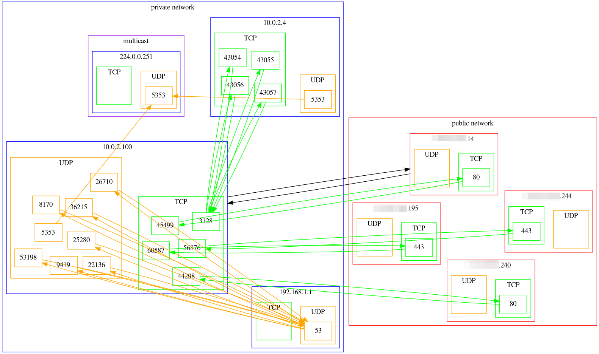
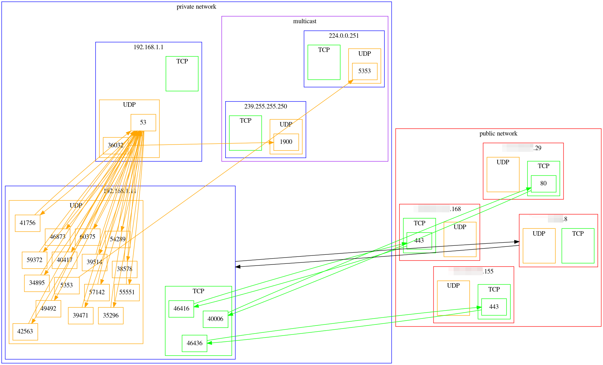

# PacketImage

Packet Flow Graph Image


## Summary

I made this tool because I want to comprehend network instantly from a lot of packet data.

For example, start and end node, protocol, port number, and so on.

This tool can do the following.

- Output packet flow graph image (PNG) from pcap file
    - IPv4 type
        - Private, Multicast, and Global Address
        - Start and End node
        - Protocol
            - IP, ICMP, TCP, UDP
        - Source and Destination Port Number
    - L2 and IPv6 type
        - <font style="color:blue">Note: l2 and ipv6 type are not implemented now.</font>


## Installation

This tool can run Linux Operationg System(e.g. Debian).

Also, You need to install the following packages.

- python 2.7.16
- python-dpkt 1.9.2-1
- graphviz 0.10.1
    - ````pip install graphviz````


## Example

1. Run
    ````
    $ python packetimage.py -h
    usage: Usage: python packetimage.py parsetype inputfile outputfile [--help]

    positional arguments:
      parsetype   ipv4 (l2 and ipv6 type are not implemented.)
      inputfile   input pcap file name
      outputfile  output file name (The file extension does not include.)

    optional arguments:
      -h, --help  show this help message and exit

    $ python packetimage.py ipv4 test.pcap testimage
    ````

## Screenshot





